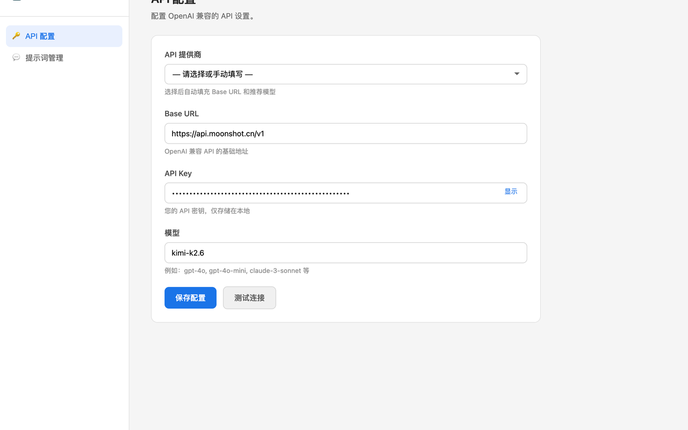
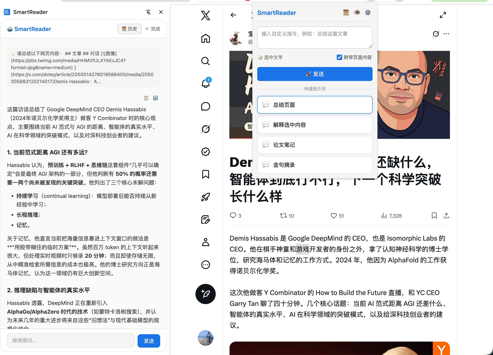
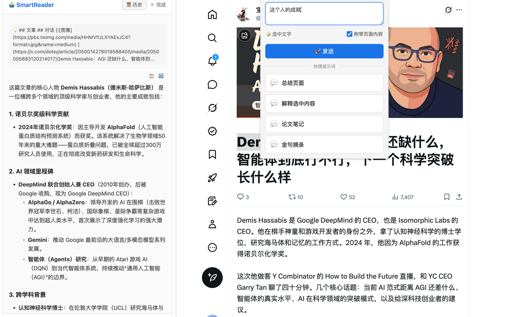
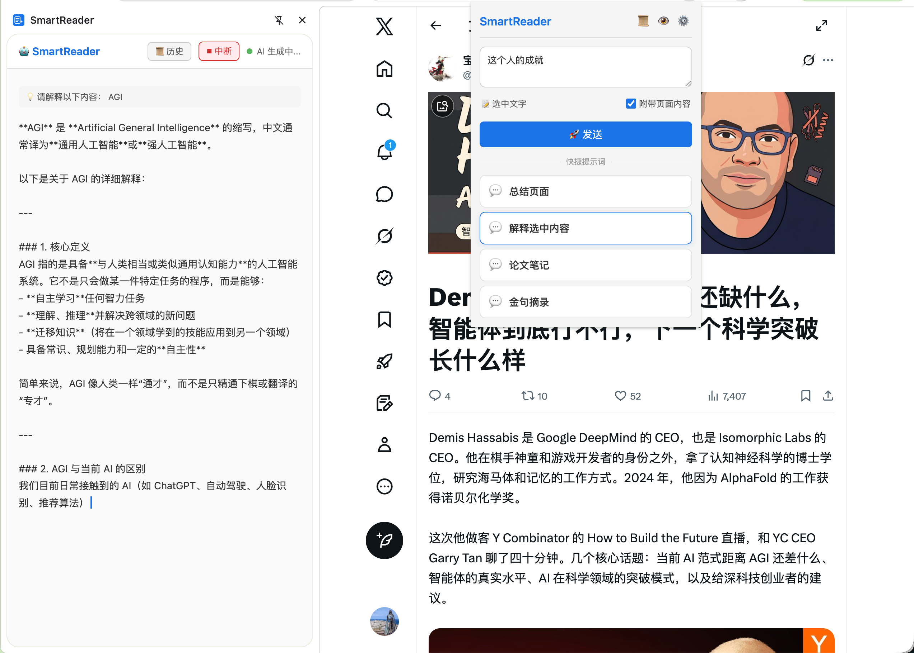
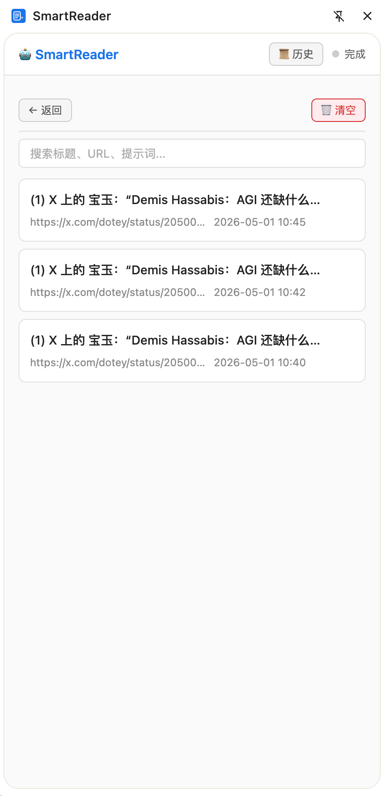
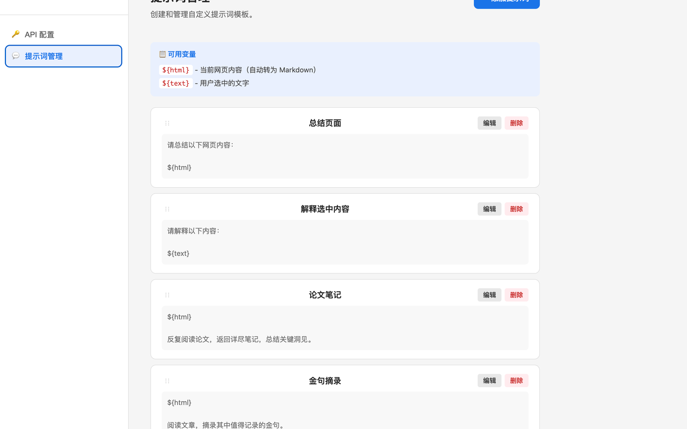

# SmartReader

[](https://github.com/pipi32167/SmartReader)
[](LICENSE)
[](https://chromewebstore.google.com/detail/smartreader/mohkobodogljjhchhaodhdckkhfmaffk?hl=en-US&utm_source=ext_sidebar)

> A Chrome Extension that summarizes web pages and answers your questions using AI APIs.

[中文文档](./README.zh-CN.md)

---

## ✨ Features

- **Webpage Summarization** — Extracts page content as Markdown and generates AI-powered summaries
- **Q&A on Web Content** — Ask questions about the current page and get streaming answers
- **PDF Support** — Extracts and summarizes text from PDF files
- **Custom Prompts** — Create and manage your own prompt templates with variables (`${html}`, `${text}`)
- **Streaming Responses** — Real-time AI responses displayed in the side panel
- **History Management** — Saves AI conversations locally for future reference
- **Side Panel UI** — Clean, non-intrusive side panel interface with Markdown rendering
- **Multi-window Aware** — Side panel messages are filtered by window to prevent cross-window interference

---

## 📦 Installation

### Install from Chrome Web Store

The easiest way to install SmartReader is from the [Chrome Web Store](https://chromewebstore.google.com/detail/smartreader/mohkobodogljjhchhaodhdckkhfmaffk?hl=en-US&utm_source=ext_sidebar).

### Install from Source (Developer Mode)

1. Clone this repository:
   ```bash
   git clone https://github.com/pipi32167/SmartReader.git
   cd SmartReader
   ```

2. Install dependencies and build:
   ```bash
   npm install
   npm run build
   ```

3. Open Chrome and navigate to `chrome://extensions/`

4. Enable **Developer mode** (toggle in the top-right corner)

5. Click **Load unpacked** and select the `dist/` folder

6. The SmartReader extension icon should now appear in your Chrome toolbar

---

## 🚀 Usage

1. **Configure API** — Click the extension icon → "Settings" (or right-click → Options), then enter your OpenAI-compatible API endpoint, key, and model.

   

2. **Summarize a Page** — Open any web page, click the SmartReader icon, and select a prompt (e.g., "Summarize this page"). The AI response will stream into the side panel.

   

3. **Ask Questions** — Use custom prompts like "What are the key takeaways?" or create your own. You can also ask questions about selected text on the page.

   

   

   After receiving an answer, you can continue asking follow-up questions in the side panel.

   

4. **Work with PDFs** — When viewing a PDF in Chrome, SmartReader will extract its text and process it just like a regular web page.

5. **View History** — All AI interactions are saved locally and can be accessed from the options page.

   

---

## ⚙️ Configuration

Go to the **Options** page to configure:

| Setting | Description |
|---------|-------------|
| Base URL | Your OpenAI-compatible API endpoint (e.g., `https://api.openai.com/v1`) |
| API Key | Your API key |
| Model | Model name (e.g., `gpt-4o`, `gpt-3.5-turbo`) |

You can also manage custom prompts and view conversation history from the options page.



### Prompt Variables

Prompt templates support two variables:

- `${html}` — The page content converted to Markdown (truncated to 30,000 characters)
- `${text}` — The text currently selected by the user on the page

---

## 🛠️ Development

### Prerequisites

- [Node.js](https://nodejs.org/) (v18+)
- [npm](https://www.npmjs.com/)

### Scripts

```bash
# Development mode (watch for changes)
npm run dev

# Production build
npm run build

# Clean build output
npm run clean

# Run tests
npm test
```

### Project Structure

```
public/
  manifest.json          # Chrome Extension Manifest (MV3)
  icons/                 # Extension icons
src/
  background/
    service-worker.ts    # Service Worker: AI requests, DB proxy, PDF processing
  content/
    content-script.ts    # Content Script: extract page content to Markdown
  offscreen/
    offscreen.ts         # Offscreen Document: sql.js + pdfjs-dist, OPFS persistence
  popup/
    popup.ts             # Popup UI: prompt list, custom input, open side panel
  sidepanel/
    sidepanel.ts         # Side Panel: receive stream, render Markdown
  options/
    options.ts           # Options page: API config & prompt management
  shared/
    types.ts             # TypeScript interfaces & MessageType constants
    constants.ts         # Default API config, default prompts
    utils.ts             # Utility functions
    html-to-markdown.ts  # Custom HTML to Markdown converter
```

---

## 🧪 Testing

This project uses [Vitest](https://vitest.dev/) with `jsdom` for unit testing.

```bash
npm test
```

Shared logic modules under `src/shared/` follow Test-Driven Development (TDD) principles. When adding new shared utilities, please include a corresponding `*.test.ts` file.

---

## 🏗️ Architecture Highlights

### Why Offscreen Document?

Manifest V3 Service Workers cannot execute WASM or access OPFS. SmartReader uses an **Offscreen Document** to host `sql.js` and `pdfjs-dist`, persisting the SQLite database to OPFS (`smartreader.db`). The Service Worker proxies all database operations to this document via `chrome.runtime.sendMessage`.

### Communication Flow

```
Popup → Service Worker → Content Script → Service Worker → AI API
                                               ↓
                                         Side Panel (streaming)
```

### PDF Processing

1. Service Worker downloads the PDF and converts it to Base64
2. First attempt: upload as OpenAI `file` type content part
3. Fallback: extract text via `pdfjs-dist` in Offscreen Document, then retry as text prompt

---

## 📄 License

[MIT](LICENSE)

---

## 🤝 Contributing

Contributions are welcome! Please feel free to submit issues or pull requests.

When contributing:
- Follow the existing code style
- Add tests for shared logic changes
- Run `npm test` before submitting
